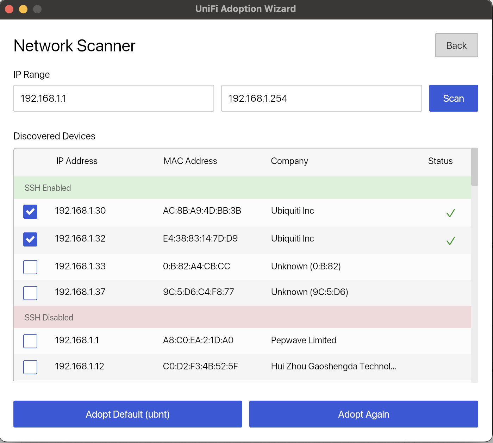
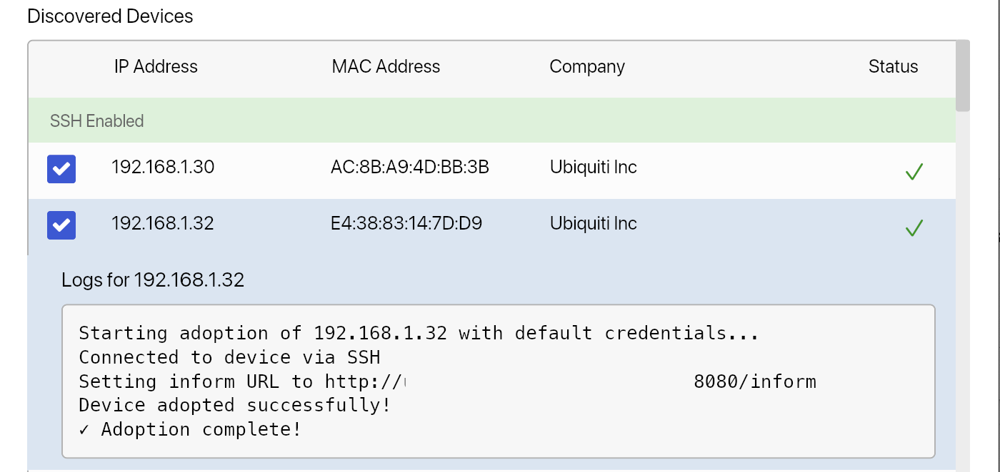

# UniFi Auto-Adoption Tool

A modern cross-platform desktop application for automating UniFi device adoption via SSH. Built with Rust and featuring a clean, intuitive GUI for network administrators managing UniFi deployments.

## Features

### Network Discovery
- **Automatic IP Range Detection**: Automatically detects your network and pre-fills the correct IP range on startup 
- **Network Scanning**: Scan IP ranges to discover devices on your network
- **SSH Port Detection**: Automatically identifies devices with SSH enabled (port 22)
- **MAC Address Lookup**: Identifies device manufacturers using OUI database
- **Visual Status Indicators**: Color-coded SSH status (green for enabled, red for disabled)

### Device Adoption
- **Single Device Adoption**: Adopt individual UniFi devices with real-time SSH output logs
- **Bulk Adoption**: Select and adopt multiple devices simultaneously
- **Dual Credential Support**: Configure both default and alternative SSH credentials for re-adopting devices
- **Real-time Logs**: View SSH command output and adoption progress in real-time
- **Expandable Device Rows**: Click on devices to view detailed adoption logs

### Configuration Management
- **Settings Panel**: Easy-to-use settings interface with tabbed navigation
- **Persistent Configuration**: Settings saved to local config file
- **Controller URL Configuration**: Set your UniFi controller URL
- **Multiple SSH Credentials**: Support for default (ubnt) and alternative credentials to make re-adoption easy

## Tech Stack

- **Language**: Rust 2021 Edition
- **GUI Framework**: [Iced](https://github.com/iced-rs/iced) v0.12 - A cross-platform GUI library
- **Async Runtime**: [Tokio](https://tokio.rs/) - Asynchronous runtime for handling concurrent operations
- **SSH Library**: [ssh2](https://github.com/alexcrichton/ssh2-rs) v0.9 - SSH client implementation
- **Network Detection**: [get_if_addrs](https://github.com/messense/get_if_addrs) v0.5 - Cross-platform network interface detection
- **Network Operations**:
  - Automatic network interface detection and IP range calculation
  - Built-in async network scanning
  - OUI database for MAC address vendor lookup
  - Port scanning for SSH detection

## Screenshots

### Network Scanner
The network scanner automatically discovers devices on your network, identifies Ubiquiti devices, and shows SSH availability:

### Adoption Logs
View detailed logs for each device adoption, including SSH connection status and inform URL configuration:

### Initial Setup

1. Launch the application
2. Click the **Settings** button
3. Configure the following:

#### General Settings
- **Controller URL**: Your UniFi controller address (e.g., `http://192.168.1.1:8080`) - don't forget to include the `:8080` port in your URL

#### SSH Credentials
- **Default Credentials**:
  - Username: `ubnt` (default)
  - Password: `ubnt` (default)
- **Alternative Credentials**:
  - Put your site credentials here so you can re-adopt devices 

## Platform Support

- macOS (tested)
- Windows (tested)
- Linux (untested)

## License

GNU General Public License v3.0

Copyright (c) 2024

This program is free software: you can redistribute it and/or modify
it under the terms of the GNU General Public License as published by
the Free Software Foundation, either version 3 of the License, or
(at your option) any later version.

This program is distributed in the hope that it will be useful,
but WITHOUT ANY WARRANTY; without even the implied warranty of
MERCHANTABILITY or FITNESS FOR A PARTICULAR PURPOSE. See the
GNU General Public License for more details.

You should have received a copy of the GNU General Public License
along with this program. If not, see <https://www.gnu.org/licenses/>.

---

**Note**: This is a utility tool for network administrators. Use at your own risk. 

## Contributing

This project is built with Rust and uses modern async patterns. The codebase is organized into modules:
- `main.rs` - Application entry point and state management
- `ssh_handler.rs` - SSH connection and command execution
- `network_interface.rs` - Network interface detection and IP range calculation
- `network_scanner.rs` - Network scanning and device discovery
- `oui_database.rs` - MAC address vendor lookup
- `config.rs` - Configuration file management
- `views.rs` - UI view definitions
- `styles.rs` - UI styling and theming
- `models.rs` - Data models and enums
- `messages.rs` - Application message types

## Acknowledgments

Built with:
- [Iced](https://github.com/iced-rs/iced) - A cross-platform GUI library for Rust
- [ssh2-rs](https://github.com/alexcrichton/ssh2-rs) - Rust bindings for libssh2
- [Tokio](https://tokio.rs/) - Asynchronous runtime for Rust

Development assisted by:
- [Claude Code](https://claude.ai/claude-code) - AI-powered development assistant
- [Gemini](https://gemini.google.com/) - Used for AI Photo editing 

Development made possible by:
- [1 SYSTEMS installation](https://1systemsinstallation.com) - The #1 low voltage installation company for complex and modern installs.
